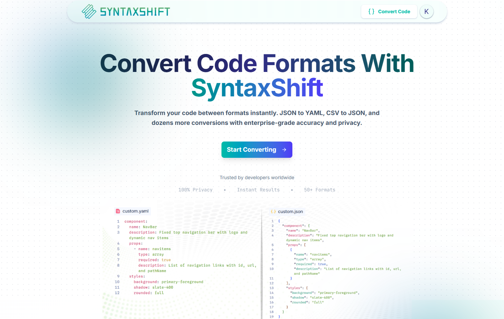
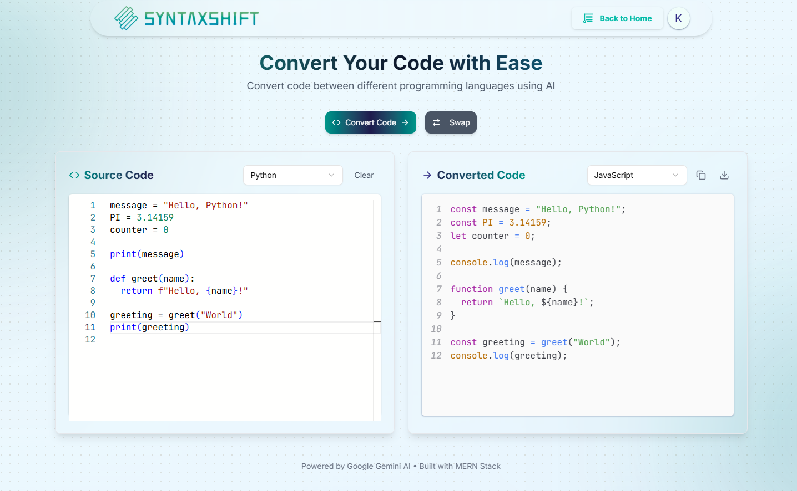

# 🔁 Shift-Syntax

**Shift-Syntax** is a powerful full-stack web application that lets users **convert code from one programming language or format to another** using the **Gemini 2.5 Pro** model. Built for speed and real-time feedback, it offers an intuitive interface, live streaming output, and syntax-highlighted results.

🔗 **Live Demo:** [https://shift-syntax.vercel.app](https://shift-syntax.vercel.app)

---

## Visuals:




## 🚀 Features

- 🔁 Convert code between multiple languages (JS, Python, Java, YAML, etc.)
- 🤖 Powered by Google Gemini 2.5 Pro (via streaming API)
- ⚡ Real-time output with Server-Sent Events (SSE)
- 🖋️ Monaco Editor for source input with language auto-detection
- 🌈 React Syntax Highlighter for clean, readable results
- 🎨 Elegant and responsive UI with **shadcn/ui** components
- 📦 Download converted code with correct file extensions
- 🧠 Designed with React 19 features for modern developer experience

---

## 🛠️ Tech Stack

### Frontend

- [React 19](https://react.dev/)
- [Vite](https://vitejs.dev/)
- [Monaco Editor](https://github.com/microsoft/monaco-editor)
- [React Syntax Highlighter](https://github.com/react-syntax-highlighter/react-syntax-highlighter)
- [shadcn/ui](https://ui.shadcn.dev/)
- [Tailwind CSS](http://tailwindcss.com/)

### Backend

- Node.js
- Express.js
- Gemini 2.5 Pro API (streaming mode)
- CORS + SSE support

---

## 🧪 How It Works

1. **User selects source & target language**.
2. **User pastes or writes code in Monaco Editor**.
3. On submit, the frontend sends a `POST` request to the Express server with source code and language info.
4. The backend streams converted code back using **SSE**.
5. The frontend reads the SSE stream and updates the output in real-time.

---

## Here's how the stream is controlled properly:


---

## 🧑‍💻 Setup Instructions

### Prerequisites

- Node.js v22
- Vite-compatible environment
- Gemini 2.5 Pro API access + API key

---

### 📦 Installation

#### 1. Clone the repo:

```bash
git clone https://github.com/KanadShee-18/Shift-Syntax.git
cd shift-syntax

```
